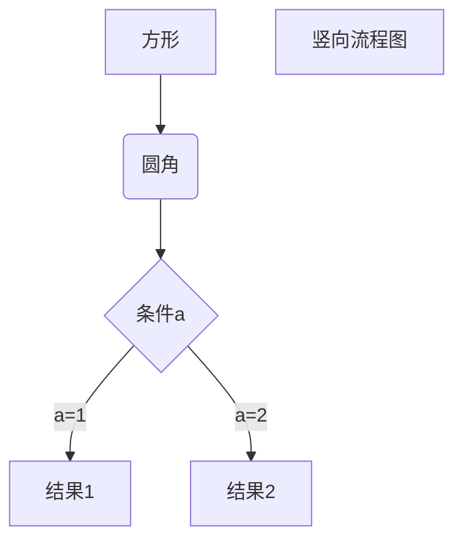

# OVERVIEW
go wechat sdk

# INSTALL
```Shell
go get github.com/TuiBianWuLu/samplewechat

cd $GOPATH/src/TuiBianWuLu/samplewechat

dep ensure
```

# Fork
```Shell
go get github.com/TuiBianWuLu/samplewechat

cd $GOPATH/src/github.com/TuiBianWuLu/samplewechat

git remote rename origin upstream

git remote add origin `your git repository addr`
```


